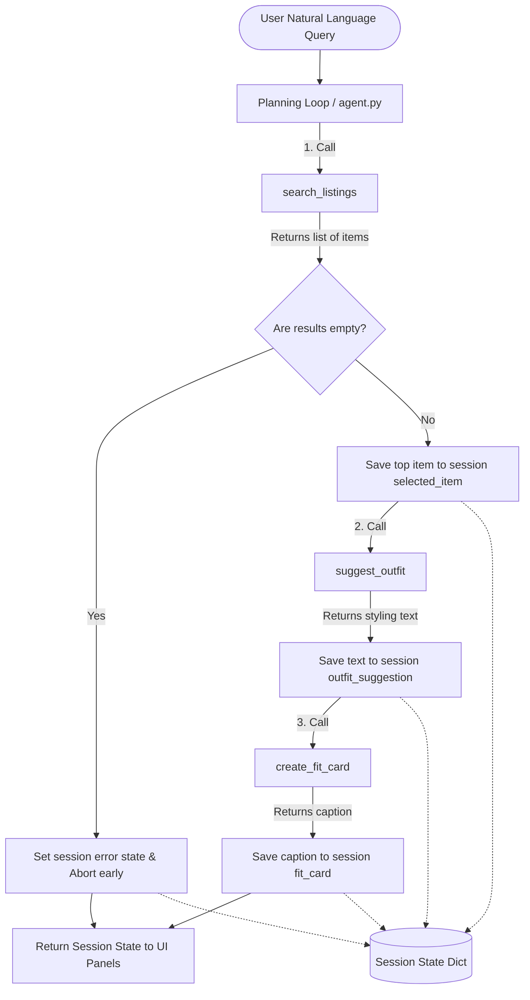

# FitFindr — planning.md

> Complete this document before writing any implementation code.
> Your spec and agent diagram are what you'll use to direct AI tools (Claude, Copilot, etc.) to generate your implementation — the more specific they are, the more useful the generated code will be.
> Your planning.md will be reviewed as part of your submission.
> Update it before starting any stretch features.

---

## Tools

### Tool 1: search_listings

**What it does:**
Looks through the mock listings dataset and pulls back the secondhand pieces that match what the user described, while respecting their size and a hard price ceiling.

**Input parameters:**

- `description` (str): The keywords the user typed (e.g. "vintage graphic tee", "leather jacket"). I match these against each listing's title, description, style tags, and category.
- `size` (str | None): The size to filter on (e.g. "M", "L", "8"). `None` means the user didn't give a size, so I skip size filtering.
- `max_price` (float | None): The most the user wants to spend. Anything priced above this is dropped. `None` means no price filter.

**What it returns:**
A `list[dict]` of matching listings, best match first. Each listing dict has: `id`, `title`, `description`, `category`, `style_tags`, `size`, `condition`, `price`, `colors`, `brand`, and `platform`. Listings with no keyword overlap are dropped, and the rest are sorted by how many keywords they hit.

**What happens if it fails or returns nothing:**
It returns an empty list `[]` — it never raises. The planning loop notices the empty list, writes a clear "here's what to try instead" message into `session["error"]`, and stops there instead of calling the next tools with nothing.

---

### Tool 2: suggest_outfit

**What it does:**
Asks the Groq LLM to come up with a complete outfit that styles the item I found, using the actual pieces the user already owns.

**Input parameters:**

- `new_item` (dict): The top listing dict that came back from `search_listings`.
- `wardrobe` (dict): The user's wardrobe — a dict with an `"items"` list, where each item follows the shape in `data/wardrobe_schema.json` (`name`, `category`, `colors`, `style_tags`, `notes`).

**What it returns:**
A `str` of styling advice — a short paragraph explaining how to wear the new piece with named wardrobe items, plus a concrete tip (how to tuck, cuff, layer, etc.).

**What happens if it fails or returns nothing:**
If the wardrobe is empty, I skip the closet-matching prompt and instead ask for general styling advice for the item on its own. If the LLM call itself errors out, I return a short fallback string built from the item's tags rather than crashing.

---

### Tool 3: create_fit_card

**What it does:**
Turns the finished outfit into a short, shareable caption — the kind of thing you'd actually post under an OOTD photo.

**Input parameters:**

- `outfit` (str): The styling text that `suggest_outfit` produced.
- `new_item` (dict): The top listing dict from `search_listings`.

**What it returns:**
A `str` — a casual 2–4 sentence caption that names the item, price, and platform naturally and sounds like a real post, not a product description. It runs at a higher temperature so it comes out different each time.

**What happens if it fails or returns nothing:**
If the `outfit` string is empty or just whitespace, I return a descriptive error message instead of calling the LLM. If the LLM call errors, I fall back to a simple caption built from the item's title and price so nothing crashes.

---

## Planning Loop

**How does my agent decide which tool to call next?**
The loop runs in order, but each step only happens if the one before it gave me something usable. State lives in one `session` dict:

1. **Parse + Search.** I pull `description`, `size`, and `max_price` out of the raw query with regex, then call `search_listings`.
2. **Branch — no results.** If the search comes back empty, I set `session["error"]` to a helpful message, skip the remaining tools, and return the session as-is.
3. **Style.** If there are results, I save the top one to `session["selected_item"]` and call `suggest_outfit(selected_item, wardrobe)`.
4. **Branch — empty wardrobe.** `suggest_outfit` checks `wardrobe["items"]` itself; if it's empty it gives general advice instead of crashing, so the loop keeps going.
5. **Fit card.** I store the styling text in `session["outfit_suggestion"]`, pass it to `create_fit_card`, and save the result to `session["fit_card"]`. Done.

So the agent's behavior actually changes with the input: an impossible query stops at step 2 with just an error; a good query runs all three tools.

---

## State Management

**How does information move from one tool to the next?**
Everything for a single run lives in one `session` dict (built by `_new_session()` in `agent.py`). It's the single source of truth — tools read what they need straight from it instead of re-asking the user:

```python
session = {
    "query": str,               # original user request
    "parsed": dict,             # {description, size, max_price} from the regex parse
    "search_results": list,     # all matching listing dicts
    "selected_item": dict,      # top result — feeds suggest_outfit AND create_fit_card
    "wardrobe": dict,           # the user's wardrobe
    "outfit_suggestion": str,   # styling text from suggest_outfit
    "fit_card": str,            # caption from create_fit_card
    "error": str,               # message if a step ended early (None on success)
}
```

The same `selected_item` dict that comes out of search flows into `suggest_outfit` and then into `create_fit_card` — no re-entry, no hardcoded values.

---

## Error Handling

| Tool              | Failure mode                          | Agent response                                                                                                                                |
| ----------------- | ------------------------------------- | --------------------------------------------------------------------------------------------------------------------------------------------- |
| `search_listings` | No results match the query            | Saves a helpful message to `session["error"]` saying nothing matched the price/size criteria and suggesting what to loosen, then stops early. |
| `suggest_outfit`  | Wardrobe is empty                     | Detects the empty `wardrobe["items"]` list and prompts the LLM for general styling advice instead, so the run continues.                      |
| `create_fit_card` | Outfit input is missing or incomplete | Catches the empty/null string, skips the LLM call, and returns a simple fallback caption from the item's title and price.                     |

---

## Architecture



---

## AI Tool Plan

**Milestone 3 — Individual tool implementations:**

- **AI tool:** Claude (Claude Code).
- **What I give it:** the Tool 1/2/3 spec blocks from this file, plus `utils/data_loader.py` so it reuses `load_listings()` instead of re-reading files.
- **What I expect back:** the function bodies for `tools.py`, with the right parameter types and try/except wrappers around the LLM calls.
- **How I verify:** write `tests/test_tools.py` and run `pytest tests/` to confirm the happy path and the empty edge cases all return cleanly without throwing.

**Milestone 4 — Planning loop and state management:**

- **AI tool:** Claude (Claude Code).
- **What I give it:** the architecture diagram, the Planning Loop section, and the `session` dict definition above.
- **What I expect back:** a `run_agent(query, wardrobe)` in `agent.py` that updates the session step by step and breaks early on the no-results branch.
- **How I verify:** run the test cases at the bottom of `agent.py` — a real match should run all three tools, and a bad search should stop at step one.

---

## A Complete Interaction (Step by Step)

**Example user query:** "I'm looking for a vintage graphic tee under $30. I mostly wear baggy jeans and chunky sneakers. What's out there and how would I style it?"

**Step 1:**
The loop starts a fresh session and calls `search_listings(description="vintage graphic tee", size=None, max_price=30.0)`. The tool loads the dataset with `load_listings()`, finds the matching tees under $30, ranks them, and returns the list. The top hit (e.g. a faded band/graphic tee around $22) goes back to the loop.

**Step 2:**
The loop sees results, saves the top item to `session["selected_item"]`, and calls `suggest_outfit(new_item=<that tee>, wardrobe=<user wardrobe>)`. Since the wardrobe has the user's baggy jeans and chunky sneakers, the LLM returns something like: _"Pair this faded tee with your baggy jeans and chunky sneakers for an easy 90s skater look — tuck the front hem so the tee doesn't swallow the waistline."_

**Step 3:**
The loop saves that text to `session["outfit_suggestion"]` and passes it, with the item, into `create_fit_card`. The tool writes a caption like: _"thrifted this faded tee for $22 and it was made for my baggy jeans + chunky sneakers 🤝 full fit in my stories."_ That goes into `session["fit_card"]`.

**Final output to user:**
The Gradio app fills three panels:

- **Top listing found:** the faded tee (title, price, platform, condition).
- ** Outfit idea:** the styling text pairing it with the user's jeans and sneakers.
- ** Your fit card:** the ready-to-post caption.
